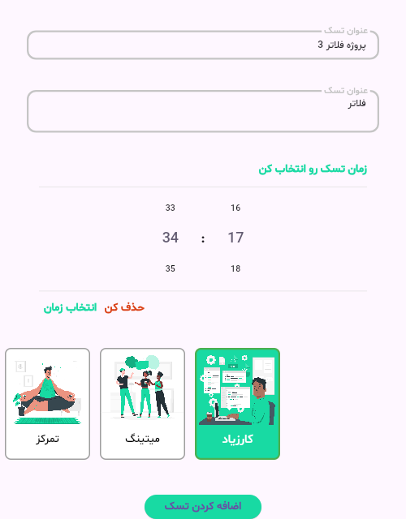
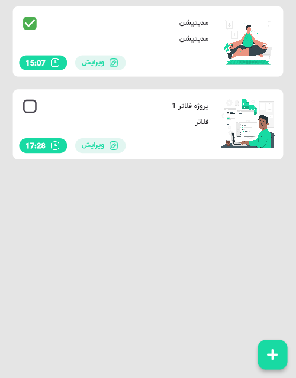

# 📝 Flutter Note App

A simple and practical **Flutter note and task management application** built with **Dart** and **Hive** for local data storage.

The app allows users to create, edit, organize, and manage their daily tasks through a clean and user-friendly interface. 📱✨

---

## ✨ Features

- 📝 Create new tasks
- ✏️ Edit existing tasks
- 🗑️ Delete tasks
- 📋 Display and manage tasks
- 🏷️ Categorize tasks by type
- ⏰ Select time for tasks
- 💾 Local data persistence using Hive
- ⚡ Fast and lightweight local storage
- 🎨 Clean and simple Flutter UI
- 📱 Responsive mobile interface

---

## 🛠️ Tech Stack

| Technology | Usage |
|---|---|
| 💙 Flutter | Mobile application development |
| 🎯 Dart | Programming language |
| 🗄️ Hive | Local database |
| 📦 Hive Flutter | Hive integration with Flutter |
| ⏰ Time Picker | Task time selection |
| ☑️ Msh Checkbox | Custom checkbox UI |

---

## 🏗️ Project Structure

```text
lib/
│
├── data/
│   ├── task.dart
│   ├── task.g.dart
│   ├── task_type.dart
│   ├── task_type.g.dart
│   ├── type_enum.dart
│   └── type_enum.g.dart
│
├── screens/
│   ├── add_task_screen.dart
│   ├── edit_task_screen.dart
│   └── home_screen.dart
│
├── utility/
│   └── utility.dart
│
├── widget/
│   ├── task_type_item.dart
│   └── task_widget.dart
│
└── main.dart
````

---

## 🗄️ Local Storage

This application uses **Hive** to store tasks locally on the device.

This means users can manage their tasks without requiring an external backend or internet connection. 🔐💾

---

## 🖼️ Screenshots

<div align="center">

<table>
<tr>
<td align="center">

</td>
<td align="center">

</td>
</tr>
</table>

</div>

---

## 🚀 Getting Started

### 1️⃣ Clone the repository

```bash
git clone https://github.com/MobinaFetrati/flutter_note_app.git
```

### 2️⃣ Navigate to the project

```bash
cd flutter_note_app
```

### 3️⃣ Install dependencies

```bash
flutter pub get
```

### 4️⃣ Run the application

```bash
flutter run
```

---

## 🎯 Project Purpose

This project was developed to practice and demonstrate:

* 💙 Flutter application development
* 🎯 Dart programming
* 🗄️ Local database management with Hive
* 🧩 Flutter widget development
* 📱 Building practical mobile applications
* ✏️ CRUD operations for local data
* 🏗️ Organizing Flutter projects into reusable components

---

## 👩‍💻 Developer

**Mobina Fetrati**

Flutter Developer | Mobile Application Developer

🔗 GitHub:
[https://github.com/MobinaFetrati](https://github.com/MobinaFetrati)

